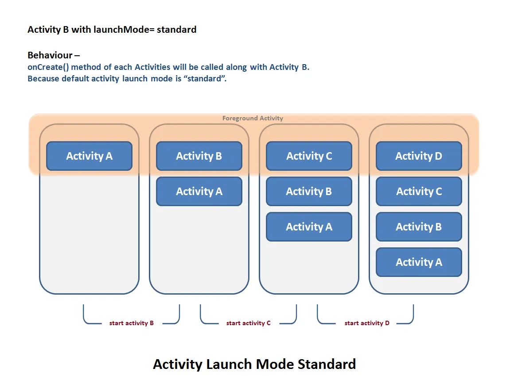
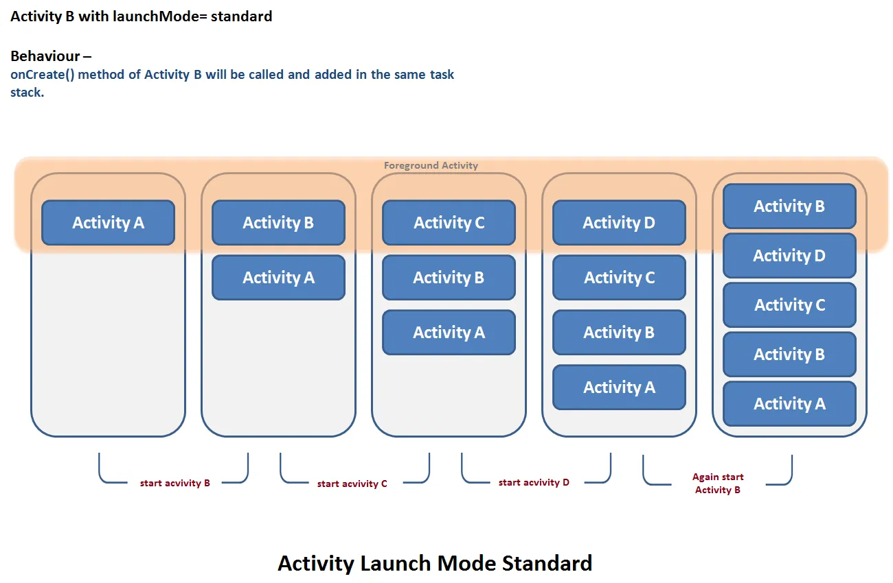
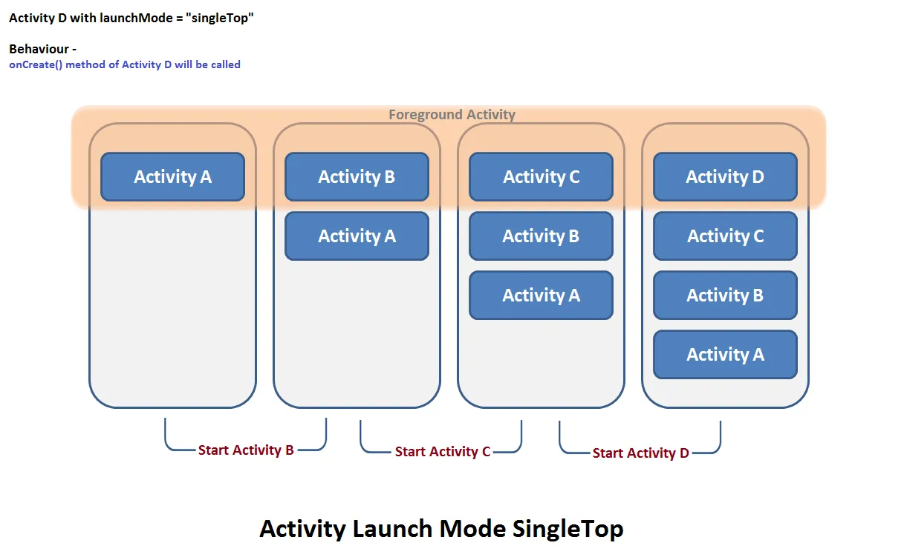
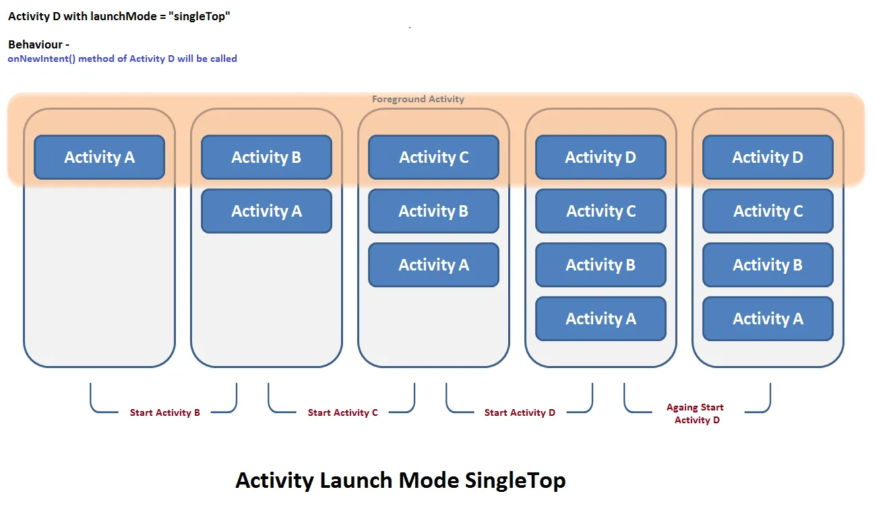
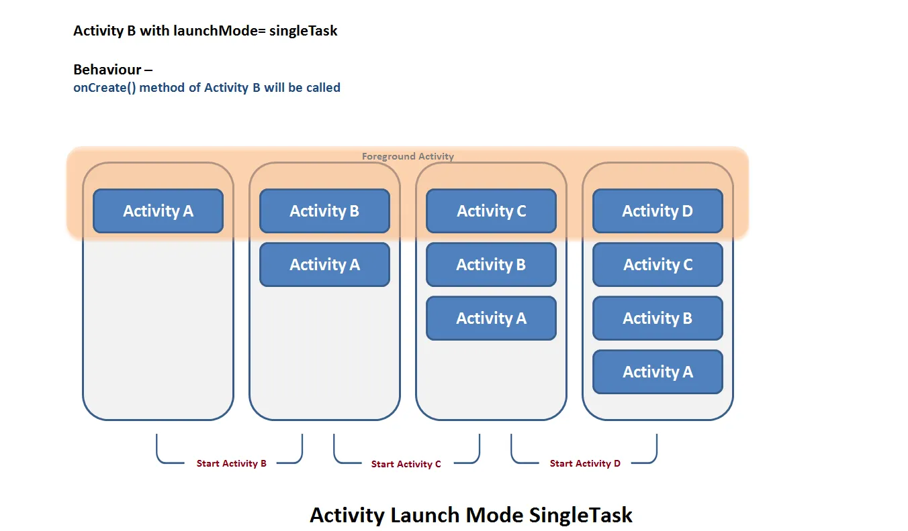
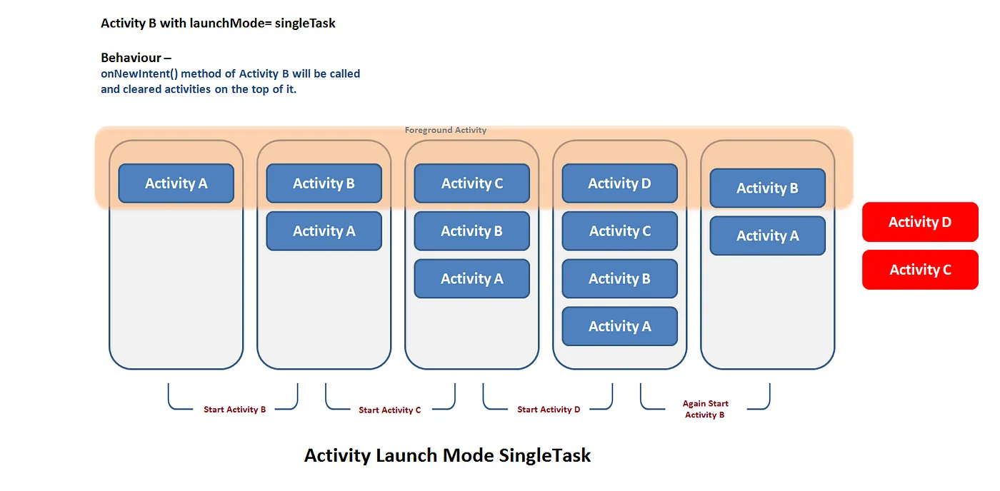
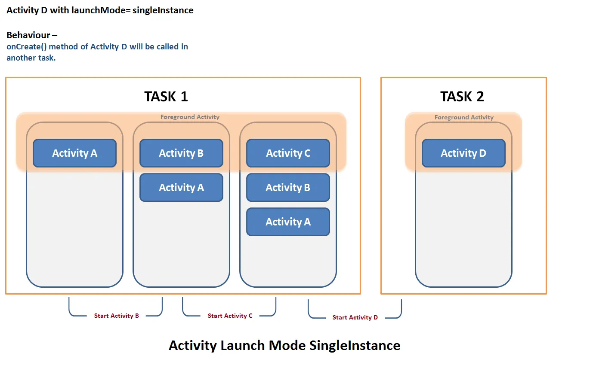
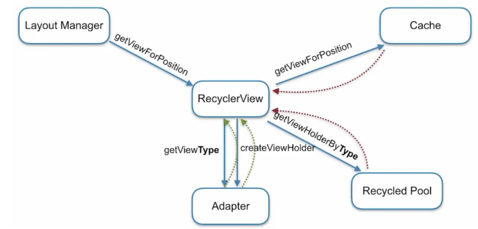

### Singleton Pattern을 작성해보세요.

- Kotlin을 사용한다면 Object 키워드로 손쉽게 만들 수 있음. _(내부적으로 LazyHolder 패턴을 지원함)_

```kotlin
object MySingleton {
    fun doSomething() { ... }
}
```

- Java를 사용한다면 LazyHolder 패턴을 사용 _(생성자에서 인스턴스를 만들고 이후에는 getIinstance로 객체를 가져오는 방법)_

```java
public class MySingleton {
    private MySingleton() {}

    private static class Holder {
        private static final MySingleton INSTANCE = new MySingleton();
    }

    public static MySingleton getInstance() {
        return Holder.INSTANCE;
    }
}
```

<br><br><br>

### lateinit 이랑 by lazy의 차이는 무엇인가요?

- lateinit은 가변 프로퍼티(var)를 사용하고 런타임 도중에 해당 프로퍼티에 값 혹은 인스턴스를 할당하고 사용하는 방식. 이후에 null을 대입해서 GC에 메모리 수거를 하게 만들 수 있음. 초기화 전에 사용하면 예외 발생할 수 있음. 지연 주입을 사용하기 위해 사용하는 방식

- by lazy는 읽기전용 프로퍼티(val)을 사용하고 해당 프로퍼티가 호출될 때 lazy 스코프 내부에 있는 객체를 생성하고 한 번 생성된 이후로는 해당 프로퍼티에 새롭게 할당할 수 없이 사용하는 방법. thread safe 하지만 null을 대입할 수 없어서 Fragment에서 XXXBinding을 사용할 때 Activity가 소멸되기 전 까지 메모리 수거를 할 수 없음.

#### Fragment에서 binding을 사용할 때 lateinit var를 사용하는 이유?

- Fragment에서 Binding을 사용할 때 Activiy의 Context를 사용해서 XXXBinding객체를 만드는데, 이는 Fragment의 onDestroyView가 호출되어도 ActivityContext가 XXXBinding을 계속 참조하고 있어서 Reachable이라고 판단하고 GC에서 수거하지 못함.
- 그렇기 때문에 onDestroyView에서 FragmentBinding을 null로 대입해줘야지만 Fragment가 소멸된 이후에 XXXBinding도 GC에 의해 수거될 수 있음.

<br><br><br>

### Context에 대해서 아는대로 말해주세요.

- 운영체제의 Context처럼 해당 맥락을 나타냄
- AppicationContext는 해당 어플리케이션의 정보를 나타내며 ActivityContext는 해당 액티비티의 정보를 담고있음.
- 그렇기 때문에 어플리케이션 내부에서 사용하는 싱글톤 객체 (DataStore, SharedPreference)들에 ActivityContext를 사용하게 되면 Activity가 소멸되더라도 Context가 Reachable이기 때문에 메모리 수거를 못해 메모리 릭이 일어날 수 있음
- 반면 UI에 종속되는 곳에 Context가 필요하다면 ActivityContext를 넘겨주면 됨
- Context는 안드로이드에서 거의 모든 시스템 기능, 리소스 접근, 컴포넌트 실행의 출발점이기도 함.

<br><br><br>

### 인텐트 플래그의 종류에 대해서 말하고 설명해주세요.

#### Activity LaunchMode

- Task란 ActivityStack이 만들어지는 별도의 단위. 새로운 앱을 실행시킬 때 Task를 만들고 거기에 Actvity Stack을 쌓음.
- Manifest의 launchMode로도 관리할 수 있으며, Intent를 호출할 때 IntentFlag로도 관리할 수 있음.

- standard : 별도의 동작없이 Activity가 호출되는 대로 Task를 계속 쌓음




- singleTop : 해당 Task가 이미 Stack의 Top에 있다면 생성되는 것이 아니라 재활용됨. 만약 Top이 아니라 중간에 있다면 생성됨. 재활용될 때에는 onPause -> onNewIntent - onResume을 타게됨. 백그라운드 알림같은 경우 Activity를 SingleTop으로 하고 Intent를 보낼경우 메모리에 올라와있는 상태라면 onNewIntent를 탐




- singleTask : RootActivity로만 존재할 수 있음. 새로운 Task가 추가될 때 만약 Task Stack에 해당 Activity가 있다면 나올 때 까지 pop함




- singleInstance : 만약 해당 Activity가 singleInstance로 되어있다면 해당 Actvity를 호출할 때 새로운 Task를 만들고 거기에 넣음. 주로 알림이나 다른 경로로 접근했을 때 특정 화면만 사용하게 하고 싶을 때 사용.



https://medium.com/@ankit.sinhal/understand-activity-launch-mode-with-examples-721e85b6421e

#### Intent Flag

양이 너무 많아서 링크로 대체

https://medium.com/@logishudson0218/intent-flag%EC%97%90-%EB%8C%80%ED%95%9C-%EC%9D%B4%ED%95%B4-d8c91ddd3bfc 

<br><br><br>

### Activity의 생명주기에 대해 아는대로 말해주세요.

```
                  r------- onRestart() ----------------ㄱ
                  V                                    |
onCreate() -> onStart() -> onResume() -> onPause() -> onStop() -> onDestroy()

onNewIntent()
```

- onCreate()는 Activity 인스턴스가 만들어질 때 실행, ConfigurationChange가 일어날 때에도 호출이됨. savedInstanceState가 Bundle? 형태로 내려오기 때문에 Intent를 담아서 startActivity를 호출하였을 때나, ConfigurationChange로 인해서 Bundle이 저장되었을 때 데이터를 꺼내올 수 있음.
컴포즈를 사용한다면 이 부분에서 setContent를 수행하며, xml을 사용한다면 바인딩을 연결해주는 부분임. DI가 실질적으로 수행되는 부분이기도 하다.

- onStart()는 onStop()과 세트며, Activity가 완전히 보이지 않을 때 onStop()이 호출된다 (액티비티 전환이후 돌아왔을 때, 홈 키를 눌러 백그라운드로 갔을 때) 이 때 돌아올 경우 호출됨.
주로 StateFlow나 SharedFlow와 같은 HotStream을 구독하는 부분이지만, Kotlin 언어에서 repeatOnLifecycle() 함수가 지원됨에 따라 해당 함수는 onCreate()로 올라갔음. _(내부적으로는 onStart에서 구독하고 onStop에서 해제하는 매커니즘임을 잊지말자.)_

- onResume()는 onPause()와 세트이며, dialog나 BottomSheet같이 Acitvitiy는 보이지만 포커스를 빼앗겼을 때 onPause()가 호출되는데 다시 Aciticty로 포커스가 돌아왔을 때 호출된다. 

- onPause()는 위에서 말했듯 Activity는 보이지만 포커스를 잃어버렸을 때 호출된다. 이 때 애니메이션 정지, 센서 일시 중지, 저장 등 빠른 정지 작업을 해주면 된다고 한다. onStop과 다르게 프로세스가 사용자가 사용하고 있는 상태이므로 가벼운 작업만 해주어야 함.

- onStop()은 Activity가 아예 보이지 않는 경우 (다른 Acitivty로 전환 및 홈으로 이동) 과 같은 경우에 호출된다. 이 때 네트워크 자원 해제를 해주면 된다고 한다. 또한 운영체제 레벨에서 메모리가 필요해서 해당 프로세스를 kill했을 때에 onDestroy까지 나아가지 않고, onStop에서 죽게되며 다시 실행하였을 때에는 onCreate()부터 시작하게 된다.

- onDestroy()는 Activity가 소멸하기 직전에 호출된다. 사용자가 finish()를 호출하거나 ConfigurationChange가 발생했을 때 호출됨. 시스템 메모리가 부족해서 해당 프로세스가 kill 당했을 때 onDestroy 호출 없이 죽을 수도 있음.

- onRestart()는 일반적인 흐름에서는 호출되지 않지만 onStop()이 호출된 이후 onStart()가 호출되기 직전 호출된다.

- onNewIntent()는 launchMode가 singleTop/singleTask이거나 Intent 플래그에 FLAG_ACTIVITY_SINGLE_TOP, FLAG_ACTIVITY_NEW_TASK가 있을 때 기존 인스턴스가 최상단이면 호출.

<br><br><br>

### Fragment의 생명주기에 대해 아는대로 말해주세요.

```
onAttach() -> onCreate() -> onCreateView() -> onViewCreated() -> onViewStateRestored() -> onStart() -> onResume() -> onPause() 
-> onStop() -> onSaveInstanceState() -> onDestroyView() -> onDestroy() -> onDetach()
```

- onAttach()는 Activity에 Fragment가 붙었을 때 호출되는 콜백, 인자로 Activity의 Context가 주어짐. 그렇기 때문에 이 콜백 이후에서부터 requireContext(), requireActivity() 호출이 안전해짐.

- onCreate()에는 savedInstanceState가 Bundle? 형태로 담겨져 내려옴. Activity의 onCreate()와 마찬가지로 이 부분에서 저장된 데이터를 꺼내올 수 있음. UI를 그리는 것은 안됨.

- onCreateView()는 UI가 그려지기 시작하는 부분. 이 부분에서 프래그먼트의 UI를 동적으로 그리거나 하는 등의 행위를 할 수 있음. 아직 UI가 사용자에게 보여지지는 않음. View가 Inflate되는 단계임.

- onViewCreated()는 onCreateView()에서 UI가 완성되었을 때 넘겨받는 부분. 사용자에게 보여지기 직전임. View는 이미 Inflate가 되어있기 때문에, 이 부분에서 Binding을 연결하거나 repeatOnLifecycle() 작업을 해주면 됨. 주의해야 할 점은 일반 lifecycleOwner를 사용하면 Activity의 LifecycleOwner를 사용하게 되므로 viewLifecycleOwner를 사용해야함. 

- onViewStateRestored()는 onCreate()와 마찬가지로 SavedInstanceState가 Bundle? 형태로 담겨져 내려옴. 그런데 왜 분리되어 있냐하면, onViewCreated()이후 뷰가 준비가된 상태라서 이 부분에서 UI와 관련된 데이터를 다시 복원해주면 됨 _(스크롤, 인덱스 등등)_ 만약 onCreate()에서 위 작업을 하려고 한다면 그려질 View가 아직 준비가 되어있지 않으므로 할 수 없을 것임.

- onStart()는 사용자에게 UI가 보여지기 시작하는 시점임. DialogFragment의 경우 이 부분에서 resize()를 해주면 되고, onStop()에서 해제된 자원을 다시 연결해주면 됨

- onPause() - onResume()도 Activity와 별반 다를 것이 없다.

- onSaveInstanceState()는 Activity가 onDestry()에서 Bundle로 데이터를 남겨놓듯이 데이터를 저장해놓는 부분. onCreate()에서 사용할 데이터와 onViewStateRestored()에서 사용할 데이터를 저장하면 됨. _(안들외드 옛날 버전에서는 onStop 직후에 호출되었지만, 최신 버전에서는 onStop 직전에 호출됨)_

- onDestroyView()는 Fragment의 ViewTree가 제거되는 부분. 주의해야 할 부분은 ViewTree가 제거되는 것이고 Fragment는 아직 인스턴스로 남아있을 수 있으므로, Binding은 반드시 null로 자원해제 해주어야 메모리 누수가 없음. 만약 onDestroyView()에서 binding = null을 해주지 않으면 백스텍에 남아있는 프래그먼트 인스턴스는 계속해서 Binding을 Holding하게 되어서 메모리 누수가 생길 수 있음.

- onDetach()는 Context가 null이 되는 시점. 이 부분 이후로 requireContext()는 에러를 뱉음

<br><br><br>

### View의 생명주기에 대해 아는대로 말해주세요.

```
onAttachedWindow() -> measure() -> onMeasure() -> layout() -> onLayout() -> dispatchDraw() -> draw() -> onDraw()

invalidate(), requestLayout()
```

- onAttachedWindow()는 부모 View가 addView()를 호출했을 때 호출되는 부분. 이 때 부터 View는 Context를 사용할 수 있음
- measure()과 onMeasure()는 View의 크기를 측정하는 부분. mesaure()는 프레임워크에서 호출하는 부분이며 onMeasure()를 개발자가 커스텀해서 사용할 수 있음
- layout()과 onLayout()은 View가 어디위치할 지를 결정하는 부분. layout()은 프레임워크에서 호출하는 부분이며 onLayout()을 개발자가 커스텀해서 사용할 수 잇음
- dispatchDraw()는 자식 View들의 draw()를 호출하는 부분
- draw()와 onDraw()는 View를 실질적으로 그리는 부분. draw()는 프레임워크에서 호출하는 부분이며 onDraw()를 개발자가 커스텀해서 사용할 수 있음

내부적으로는 다음과 같이 설계되어 있음

```kotlin
draw() {                // 프레임워크가 호출하는 부분
    onDraw()            // 개발자가 커스텀하는 부분
    dispatchDraw()      // disaptchDraw()를 호출해서 자식 View들의 draw()를 호출하는 부분
}
```

https://velog.io/@haero_kim/Android-View-%EC%9D%98-%ED%95%9C-%ED%8F%89%EC%83%9D-%EC%82%B4%ED%8E%B4%EB%B3%B4%EA%B8%B0

<br><br><br>

### 포그라운드 서비스에 대해 아는가? 서비스의 생명주기는? _(음악, 네비게이션 어플 면접 대비)_

- 백그라운드 작업을 하는데, 지속성 알림을 뛰움으로써 사용자에게 동작하고 있다는 것을 알리는 서비스
- 주로 음악 어플이나, 네비게이션 앱, 헬스체크 앱에서 사용함

#### Service의 생명주기

`onCreate() → onStartCommand() → (작업 수행) → stopSelf() or stopService() → onDestroy()`

- onCreate()는 Service가 생성되자마자 1번 호출, 초기화 작업 수행
- Service가 한 번 생성되더라도 Service는 여러 번 호출될 수 있는데, startService()를 호출할 때 마다 onStartCommand() Callback을 타게 됨
- stopSelf()는 Service에게 할당된 태스크를 모두 진행하였을경우 내부적으로 스스로 꺼지는 Callback
- onDestroy()는 서비스가 완전히 종료될 때 리소스 해제 등을 하는 메소드

<br><br><br>

### Parcelable vs Serializable의 차이를 설명해주세요.

- Serializable은 언어에서 지원하는 직렬화/역직렬화 기능으로 내부적으로 리플렉션을 이용해서 직렬화 및 역직렬화를 사용함으로 약간은 느릴 수 있음.
- Parcelable은 Android 프레임워크에서 제공하는 직렬화/역직렬화 기능으로 리플렉션을 사용하지않고 개발자가 메서드를 오버라이드해서 사용할 수 있어서 보다 빠를 수 있지만 프레임워크 의존성이 추가됨.

<br><br><br>

### Debounce, Throttle에 대해서 설명해주세요.

- Input이 잦기 때문에 그 때마다 트리거를 발동할 수 없을 때 트래픽을 줄이는 기법
- Debounce는 일정시간을 설정하고 일정 시간동안 추가적인 호출이 발생했을 때 타이머를 다시 돌림. 만약 타이머가 다 될 때까지 추가 동작이 없으면 그제야 트리거를 발동 "가장 마지막 입력만 허용"
- Debounce는 주로 텍스트 검색, 자동완성 기능에 사용함
- Throttle은 Debounce와 다르게 타이머를 돌린 뒤 그 사이의 호출은 무시함. 그리고 타이머가 돌아가는 동안 들어온 Input은 무시 “가장 처음 입력만 허용”
- Throttle은 주로 스크롤 이벤트나 버튼 중복 호출 방지에 사용함

Debounce는 Flow에서 지원 Throttle은 언어에서 지원하지 않기 때문에 직접 커스텀해서 사용해야함.

https://blog.naver.com/tgyuu_/223057071742

<br><br><br>

### 이미지 라이브러리는 어떤 것을 써보았고 차이점에 대해서 설명해주세요.

- Glide, Coil
- Glide는 내부적으로 Java의 Excutor + Thread를 이용해서 비동기로 이미지를 호출함
- Coil은 내부적으로 Coroutine을 이용해서 비동기로 이미지를 호출함
- 둘다 메모리 캐싱 + 디스크 캐싱을 진행하지만, Glide는 내부적으로 메모리 케싱을 할 때 WeakReference를 이용해서 케싱을 하는 것도 있음
- Coil은 OkHttp의 디스크 캐싱을 사용, Glide는 내부적으로 DiskLruCache를 사용함.
- Compose에 대한 지원은 Coil이 매우 강력함 _(공식문서에서도 밀어줄 정도)_ 반면 Glide는 Coil에 대한 지원이 약함

<br><br><br>

### 이미지 라이브러리는 내부적으로 어떤 것들을 처리해주는 지 아는대로 말해주세요.

- ImageLoader + Fetcher + Decoder + Cache + Transformation 으로 동작
- ImageLoader는 Fetcher와 Decoder, Cache를 역할 수행을 하기 위해 절차를 제공해주는 객체
- Fetcher는 Network호출이나 로컬 파일일 경우 파일을 가져오거나 Drawable일 경우 Drawable을 가져오는 역할을 함
- Decoder는 바이너리 데이터로 되어있는 미디어 파일을 Bitmap이나 Drawable 객체로 복호화, 리사이징 및 형변환을 해주는 기능을 함
- TransFormation에서는 clip이나 색상변환, 역전 등의 추가 기능을 지원해줌
- 내부적으로 메모리 캐시와 디스크 캐시를 병행하며 최초 호출 이후 보다 빠른 응답을 지원함

<br><br><br>

### 이미지 캐싱을 하는데 사용하는 알고리즘엔 어떤 것이 있을까요?

- LruCache, LfuCache 등이 있겠지만 안드로이드 프레임워크 적으로 LruCache를 제공하고 주로 LruCache를 사용
- AndroidLruCache는 내부적으로 LinkedHashMap이라는 자료구조로 구현되어있고, 이는 실제로 LinkedList와 HashMap으로 이루어져있음 _(HashMap의 Key값은 Element의 hashcode()값)_
- LfuCache도 마찬가지로 LinkedList와 HashMap으로 구현할 수 있음. _(HashMap의 Key값이 호출된 횟수)_

<br><br><br>

### AndroidLruCache는 내부에 어떤 자료구조를 사용해서 구현되어있나요?

- 위 답변과 동일 AndroidLruCache는 내부적으로 LinkedHashMap이라는 자료구조로 구현되어있고, 이는 실제로 LinkedList와 HashMap으로 이루어져있음

<br><br><br>

### 직렬화, 역직렬화 라이브러리 아는대로 말해주고 차이점에 대해서 설명해주세요.

- Gson, KotlinXSerialization, Moshi 등
- Gson은 리플렉션을 기반으로 직렬화 및 역직렬화를 사용하므로 요청, 응답받는 DTO에 별다른 어노테이션을 달 필요 없음.
- 하지만 Gson은 응답의 기본값을 할당하지 못하는 단점이 있으며 리플렉션 기반이라서 성능이 느림.
- KotlinXSerilization은 어노테이션 기반으로 동작하기 때문에 요청 및 응답 DTO에 어노테이션을 추가적으로 달아줘야함.
- KotlinXSerilization은 기본값 할당 가능하며 매우 빠르게 동작

<br><br><br>

### Piece 프로젝트에서 KotlinXSerialization이랑 Gson 둘 다 사용했던데 이유가 있나요?

- Network에서 사용하는 DTO는 KotlinXSerilization을 사용해서 빠른 요청 및 응답을 위해 사용하였음
- DataStore에 객체를 저장 및 꺼내올 때 직렬화 및 역직렬화 용으로 Gson을 사용하였는데, 이는 DataStore를 캐싱용도로 사용하고 있는데 해당 모듈에 불필요한 DTO를 추가적으로 만들고싶지 않아서 DomainModel을 직접사용하려고 하였음. Domain 모델에 Kotlinx.serialization 관련 어노테이션(@Serializable)을 추가하고 싶지 않았기 때문에, 리플렉션 기반으로 동작하는 Gson을 사용해 domain 모델을 그대로 직렬화·역직렬화 하도록 설계하였음.

<br><br><br>

### Intent와 PendingIntent의 차이점에 대해서 설명해주세요.

- Intent는 다른 컴포넌트간의 통신을 위해서 사용
- PendingIntent는 나중에 실행할 수 있도록 Intent를 시스템에 위임하는 객체, 보통 알림(Notification), AlarmManager, AppWidget 등에서 사용자 액션에 의해 실행될 때 사용됨

<br><br><br>

### ListView와 RecyclerView의 차이점에 대해서 설명해주세요.

- ListView는 뷰 재활용은 하지만 재활용 로직을 개발자가 직접 관리해야 해서 코드가 복잡해지고 성능이 떨어지기 쉬움
- ListView는 가로스크롤을 지원하지않고 세로 스크롤만 지원
- ListView는 성능 최적화를 위해 convertView를 통해 View를 재활용하는데, 각 항목에 대해 내부적으로 findViewById()를 매번 호출해야하기 때문에 성능이 좋지 못함. 단일 View라면 상관없겠지만 ViewGroup()을 사용할 경우 성능상 이슈가 있음
- RecyclerView는 ViewHolder 패턴을 강제하여 뷰 바인딩을 미리 캐싱하고, 스크롤 시에도 재사용 가능한 ViewHolder 객체를 자동으로 관리함.
- 스크롤로 화면에서 사라지기 직전까지 유지되는 Cache 영역에 있는 데이터는 ViewHolder + 바인딩이 되어있는 ViewHolder이며, 바인딩이 풀리더라도 ViewHolder 객체는 Recycled Pool에 저장되어 onCreateViewHolder()가 호출되면 ViewwType에 맞는 객체를 적재적소에 꺼내서 사용할 수 있음.



https://blog.naver.com/tgyuu_/223595686577

<br><br><br>

### RecyclerView와 LazyColumn의 차이점에 대해서 설명해주세요.

- RecyclerView는 ViewHolder를 이용해서 뷰 및 데이터를 재활용하는 방식
- LazyColumn은 화면에 보이는 항목만 Compose composition 트리에 포함시켜서 그리는 Lazy 방식으로 동작함

<br><br><br>

### 중첩스크롤을 구현해본 경험이 있다면 이 때 어떻게 대응을 하였는지 설명해주세요.

- XML을 사용한다면 NestedScrollView나 ViewType을 사용할 수 있음.
- NestedScrollView를 사용한다면 ScrollView의 이점을 다 잃어버리고 모든 요소가 한번에 그려지는 성능상 이슈가 있음
- 이를 보완하기 위해 하나의 RecyclerView에 ViewType을 이용해서 View를 분기할 수 있음

https://blog.naver.com/tgyuu_/223787947485

- Compose를 사용한다면 NestedScrollConnection이나 NestedScrollDispatcher를 이용할 수 있음
- 이는 내부적으로 자식의 스크롤, 플링을 부모로 전파하거나 부모의 스크롤, 플링을 자식으로 전파하는 기능을 가지고 있음

https://blog.naver.com/tgyuu_/223322379764

<br><br><br>

### Dalvik과 ART에 대해서 아는대로 설명해주세요.

- Dalvik은 내부적으로 JIT 컴파일러를 사용. Android 4 버전 까지는 JIT로만 컴파일을 진행하였음.
- JIT는 앱이 실행되는 시점에 컴파일을 시작하기 때문에 스토어 상에 올라와있는 앱 크기가 작아서 빠르게 다운로드 할 수 있었지만 앱을 실행시킬 때 마다 많은 시간이 걸렸음.

- ART는 Android 5이후에 도입되었으며 내부적으로는 AOT 컴파일 방식을 사용
- Android 5~6에서는 ART로만 컴파일되었음.
- AOT는 사전에 컴파일된 파일을 스토어에 올려서 다운받는 앱 크기는 크지만 실행시 매우 빠르다는 장점이 있음

https://blog.naver.com/tgyuu_/223595686577

<br><br><br>

### 최근에는 어떤 방식으로 컴파일 하나요?

- Android 7이후로 ART + Dalvik을 이용해 각자의 장단점을 조율한 컴파일 방식 채택
- 스토어에 올릴 때에는 Dalvik처럼 코드내용을 올림
- 이 과정에서 BaselineProfile과 같이 사전에 AOT를 돌릴 수 있는 정보를 제공하거나 Startup Profile을 통해 Dex파일을 최적화하여 앱 설치시간 및 초기 실행속도를 최적화할 수 있음
- 휴대폰이 충전중이거나 많은 CPU를 사용하지 않을 때 조금씩 AOT 컴파일을 돌려서 oat파일을 만들어서 보다 더 빠른 실행속도를 지원함
- 최근에는 구글에서 Cloud Profile도 도입하여서 사용자들의 정보를 바탕으로 aot를 더 돌려놓는 방식도 사용

https://blog.naver.com/tgyuu_/223595686577

<br><br><br>

### 안드로이드에서 백그라운드 동작을 하는 방법을 아는대로 말해보세요.

#### 앱 내 백그라운드 처리

- Handler + Looper를 이용해서 백그라운드 동작
- Java Thread를 이용해서 워커 스레드를 만들고 백그라운드 동작
- RxJava를 이용한 비동기 처리
- Coroutine을 이용하여 비동기 처리

#### 시스템 상 백그라운드 처리

- Service
- WorkManager

- WorkManager는 백그라운드에서 지속적으로 동작해야 하는 경우나 네트워크 연결이라는 특정한 조건, 혹은 백그라운드에서 동작하는데 신뢰 및 안정성이 보장되어야 하는 작업에 적합
- WorkManager로 실행한 작업은 OS수준에서 신뢰성을 보장하며 실패하더라도 자동으로 재시도 함.
- 주로 로그 파일 전송이나 미디어 파일 백그라운드 전송 등에서 사용 _(onStop에서 사용자 로그 전송을 할 때 WorkManager한테 위임하여 신뢰성 있는 전송을 보장, Coroutine으로 할 경우 긴 작업이거나 프로세스를 종료시키면 전송이 실패할 수 있음)_

<br><br><br>

### 안드로이드에서 메모리 누수를 감지할 수 있는 방법은 어떤 것이 있을까요?

- LeakCanary를 사용해서 메모리 누수 탐지
- AndroidProfile를 이용해서 메모리 스냅샷 확인
- HeapDump를 사용해서 누수지적 추적

<br><br><br>

### 안드로이드에서 로컬에 데이터를 저장할 수 있는 방법은 어떤 것들이 있는지 아는대로 말해주세요.

- SQLLite, Room, DataStore, SharedPreference, Realm

<br><br><br>

### 안드로이드에 도입할 수 있는 캐싱 전략을 아는대로 말해주세요.

- 위에서 말한 로컬 데이터 저장을 이용한 디스크 캐시
- Repository나 HashMap, 프로퍼티 등을 이용한 메모리 캐시
- OkHttp를 이용한 네트워크 캐시
- Glide와 Coil과 같은 이미지 라이브러리를 이용한 이미지 캐시

<br><br><br>

### 안드로이드의 커스텀 스킴에 대해서 아는대로 설명해주세요.

- web에서 http, https로 시작하는 것 처럼 어플에서 링크를 달 수 있는데 이 때 적용되는 스킴
- 해당 스킴을 이용해서 암시적으로 해당 스킴을 가지고 있는 모든 앱을 호출할 수도 있으며, 명시적으로 해당 어플리케이션을 실행시킬 수도 있음
- 요즈음에는 멀티 모듈 등을 도입하면서 딥링크로 네비게이션을 동작하므로 중요한 역할

<br><br><br>

### MultiPart에 대해서 설명해주세요.

- Http에서 여러 종류의 데이터를 한 번에 업로드할 때 사용되는 Content Type
- 주로 서버에 이미지나 미디어 파일을 업로드할 때 사용
- 이미지 파일의 경우 이미지 데이터 + 파일 이름과 같이 여러 타입의 데이터를 전송해야 하는데, 이처럼 여러 타입의 데이터를 한 번에 전송할 때 사용
- Android에서는 Okhttp + Retrofit + @Multipart + @Part 조합으로 손쉽게 구현가능

<br><br><br>

### Retrofit을 사용할 때 GET이나 DELETE에 Body를 담는 방법에 대해서 설명해주세요.

- @GET, @DELETE과 같이 사전에 정의된 어노테이션은 RESTful API에 맞게 Body를 삽입할 수 업도록 정의되어 있음
- 하지만 정말 Body가 필요하다면 @HTTP 어노테이션을 사용해서 method에 "GET"을 삽입, hasBody = true를 통해 사용할 수 있음

```kotlin
@HTTP(method = "GET", path = "/search", hasBody = true)
fun searchWithBody(@Body request: SearchRequest): Response<T>
```

<br><br><br>

### MultiDex에 대해서 아는대로 설명해주세요.

- 일반 Dex파일은 메소드를 64K밖에 저장하지 못함 그렇기 때문에 어플리케이션의 규모가 커지거나 외부 라이브러리를 많이 사용한다면 초과할 수 있음
- 이 때 Mutldex를 사용하면 dex파일을 2개 이상으로 쪼개어 65K이상의 메소드를 사용할 수 있게됨
- Android 5.0 부터는 기본 지원되는 기능임

<br><br><br>

### Zygote에 대해서 아는대로 설몀해주세요.

- 휴대폰이 부팅될 때 Linux Kernal의 Init에서 시작되는 모든 프로세스의 부모인 마스터 프로세스
- 대부분의 앱에서 공통으로 사용되는 ART나 Native Method나 ClassLoader 등을 가지고 있으며, 새로운 앱이 실행될 때 Zygote를 fork()해서 공통된 로직을 빠르게 로드할 수 있게 함
- fork()시 운영체제의 시스템 호출처럼 COW(Copy On Write)가 적용하여 쓰기 작업 전에는 공통된 메모리를 가리키고 있기 때문에 상당히 빠름
- 만약 Zygtoe가 없었다면 Android OS의 핵심 프로세스인 System Server를 이용해서 일일이 NativeMethod나 Class Loader 등을 하나하나 만들어내야해서 느려졌을 것임
- SystemServer 또한 프로세스 이기 때문에 Zygote의 Init에서 fork()되어 생성됨

```plaintext
[부팅 단계]
──────────────────────────────────────────────
📱 Linux Kernel
    │
    ▼
🔧 init 프로세스 (/init.rc)
    │  - 시스템 프로세스 시작
    │
    ▼
⚙️ Zygote 프로세스 시작 (app_process 실행)
    │  - ART(VM), 기본 라이브러리, 클래스 preload
    │
    ▼
🧬 ZygoteInit.main()
    │  - Zygote 준비 완료
    │
    ▼
🚀 startSystemServer()
    │
    ▼
🧠 SystemServer 프로세스
    │  - ActivityManagerService
    │  - PackageManagerService
    │  - WindowManagerService
    │  - PowerManagerService ...
    │
    ▼
📲 Launcher (홈 앱) 실행
──────────────────────────────────────────────
[앱 실행 단계]
──────────────────────────────────────────────
👆 사용자가 아이콘 클릭
    │
    ▼
🎮 ActivityManagerService (AMS)
    │  - 앱 실행 여부 확인
    │
    ├── (앱 실행 중이면) → 포그라운드 전환
    │
    └── (앱 미실행 상태)
          │
          ▼
     🔁 Zygote에게 fork 요청
          │
          ▼
     👶 Zygote → fork() → 새 앱 프로세스 생성
          │
          ▼
     🧠 새 앱 프로세스 시작
          │
          ▼
     🔁 AMS가 ActivityThread에 launch 요청
          │
          ▼
     🧩 Application 클래스 onCreate()
          ▼
     📱 MainActivity 띄움
──────────────────────────────────────────────
```

#### 그럼 FCM을 받게되면 백그라운드에서도 알림을 받을 수 있는데 SystemServer로 전송하는 건가요?

- 그건 아님. FCM으로 들어온 알림 메세지는 Google Play Service(GMS)라는 앱에서 수신하고, 이를 NotificationManager를 통해 요청, 이후 SystemServer의 NotificationManagerService로 전송됨
- 여기서 말하는 Google Play Service는 Google과 관련된 서비스를 사용하기 위해 대부분 항상 백그라운드로 동작하고 있는 시스템 앱임
- 예를 들어 gmail, 캘린더, PlayStore, GoogleMap 등과 같은 서비스를 제공하기 위해 대부분 켜져있음 _(앱인데도 시스템 수준 권한을 가지고 있음)_
- 그렇기 떄문에 FCM은 GMS가 없는 어플에서는 동작하지 않으며, 샤오미나 화웨이 같은 Non-Google 디바이스에서는 동작하지 않음.

<br><br><br>

### Kotlin과 Java가 하나의 프로젝트에 있다면 어떤식으로 컴파일 되는 지 설명해주세요.

- kt파일이 먼저 .class파일로 컴파일된 이후 .java 파일이 .class파일로 컴파일 됨
- 그렇기 때문에 Java의 Lombook이나 Kapt를 사용하면 컴파일 에러가 날 수 있음 _(kt파일과 java파일이 각자 컴파일되기 때문에 서로의 어노테이션을 이해하지 못함)_

<br><br><br>

### R8을 적용한다면 내부적으로 어떤 난독화와 최적화를 하는 지 설명해주세요.

- shrinkResource를 사용할 경우 사용하지 않는 리소스 파일 제거
- unReachable한 코드 제거
- 클래스 및 메서드 식별자를 짧은 단어로 축소시켜서 코드의 절대적 물리량 대폭 축소
- NativeMethod의 경우 함수 명과 같은 디버그용 데이터들을 모두 제거하고 메모리 주소로 변경하여 최적화
- if-else에서 사용하지 않는 Else문 제거 및 클래스 내부에 서브 클래스가 존재하는데 인스턴스화 되지 않을 경우 클래스 결합, 메소드로 분리되었지만 별로 사용되지 않는 경우 inline으로 변경후 각각 대입

<br><br><br>

### baselineProfile, Startup Profile에 대해서 아는대로 설명해주세요.

- BaselineProfile은 스토어에 올라가는 시점에 oat파일로 컴파일 할 수 있는 Hot Path 코드들을 같이 올려서 사용자들이 보다 빠른 Cold Start를 할 수 있게 지원
- BaselineProfile을 사용하지 않는다면 앱이 업데이트되거나 앱 설치 이후 초기 실행시 달궈진 oat파일이 없기 때문에 단순 JIT를 사용할 때 처럼 Cold Start가 느림
- StartupProfile의 경우는 BaselineProfile과 마찬가지로 HotPath를 Profile로 등록하는 건 동일하지만, oat 컴파일 용도가 아니라 dex파일에서 같이 사용되는 파일들을 비슷한 위치로 재배치하여 최적화 시켜줌 _(해당 메소드 및 클래스 호출 시 ClassLoader, DexLoader의 속도가 향상됨)_

<br><br><br>

### Manifest에 대해 설명해주세요.

- Application 및 컴포넌트들의 신분증과 같은 역할
- 내부에 권한이나 메타 데이터 등을 정의하여 이를 기반으로 Android OS를 파일을 설치, 요청, 보호함
- 운영체제의 PCB/TCB처럼 메타 데이터를 저장하고 있음 _(완전히 같지는 않음. PC Register같은 것은 없으니)_
- 예를 들어 FCM을 사용하면서 Manifest에 FCM Service와 Meta-data를 등록하지 않으면 수신을 못함
- 메시지가 와도 어떤 어플리케이션의 어떤 컴포넌트가 이를 받을 지 모르기 때문임

<br><br><br>

### Mutex와 synchronized의 차이가 뭔가요?

- Mutex는 Kotlin.coroutine에서 제공해주는 객체로, 명시적으로 비관적 락을 걸어두는 방법 코틀린에서는 코루틴 내부에서 동기화를 지원하려고 만들었음.
- Mutex는 내부적으로 또 Lock 재진입 _(2중 Lock)_을 하려고 할 경우 예외를 던짐
- synchronized는 Java에서 제공해주는 언어 키워드로 Mutex의 Monitor 기능, 스코프에 들어갈 때 Lock을 획득하고 벗어날 때 Lock을 반환함. 코루틴 내에서 사용하면 Blocking되므로 주의
- 그렇기 때문에 코루틴 환경에서는 Mutex를 이용해서 동기화, 자바의 스레드 환경에서는 synchronized를 이용해서 동기화 해야함.

<br><br><br>

### 모바일 검색에서 검색어 자동완성이나 검색어 유사도 판단에 쓰이는 건 어떤 것이 있나요?

- 입력 타이밍은 Debounce나 Throttle을 요구사항에 맞게 사용하여 트래픽 제어
- 내부적으로는 트라이 자료구조를 사용하거나 서버 API를 요청하여 자동완성을 뛰움
- 검색어 유사도 판단에는 NLP 기반 알고리즘이 있다고는 하는데 구현할 때 알아볼 것 같음..

<br><br><br>

### 사용자가 입력 결과를 보내는 도중 네트워크가 단절되는 경우 어떻게 처리할 수 있나요?

1. 로컬 DB에 사용자가 입력한 데이터를 손실되지 않게 임시 저장
2. 서버 전송 실패를 대응하기 위해 WorkManager를 이용해서 확실한 재전송을 하던지, Retry를 시도하던지, 즉시 에러 처리 이후 수동 재전송을 유도하던 지를 선택해야함
3. 사용자에게 네트워크 연결이 귾겼다고 인지시킨 후 재전송과 같은 UX를 뛰움 

<br><br><br>

### FCM으로 푸시 알림을 수신하는 전체 흐름을 설명해주세요.

1. 사용자가 로그인이나 회원가입을 할 때 DeviceToken을 서버로 전송
2. 서버는 해당 DeviceToken으로 보낼 메시지가 있을경우 전송
3. 클라이언트에서는 FCM Service를 Manifest에 등록한 뒤, Notification을 Service에서 수신할 때 PendingIntent로 알림을 클릭했을 시 수행 동작을 정의해 둠
4. 이후 사용자가 로그아웃이나 회원탈퇴를 할 때 서버에 DeviceToken을 제거
5. FCM의 DeviceToken은 기본적으로 180일의 TTL을 가지며, 새롭게 갱신될 경우 FCMService의 onNewToken()을 통해서 발급받을 수 있음

<br><br><br>

### dp, sp를 설명해주세요.

