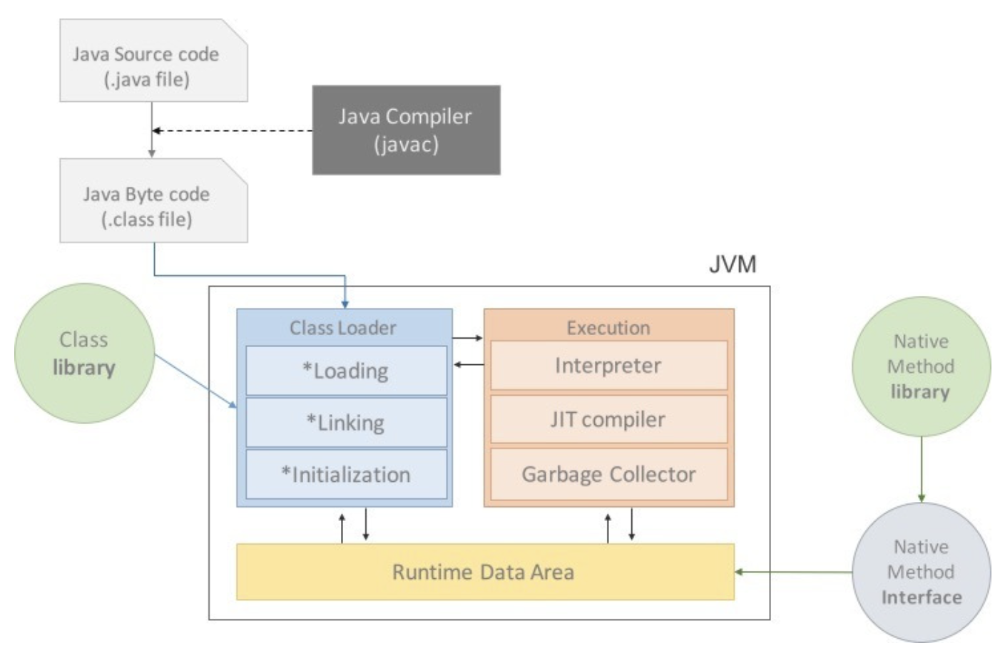
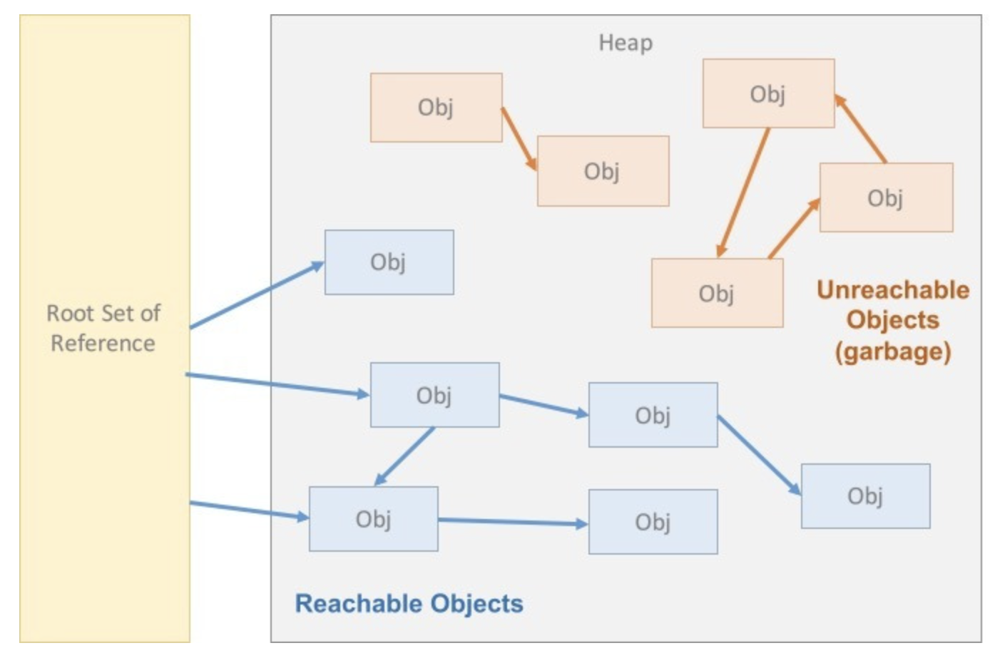

### JVM

- JVM은 Java Virtual Machine의 약자로 Java와 OS사이에 위치하며 어떤 OS라도 Java가 실행될 수 있게 만들어주는 중계자 역할을 수행함
- 자바 어플리케이션을 클래스 로더로 읽은 뒤, 자바 API와 함께 실행할 할 수 있게 해줌
- 메모리 관리, Garage Collection을 수행
- 스택 기반의 가상 머신임

   

### 자바 프로그램 실행 과정

1. 프로그램이 실행되면 JVM은 OS로부터 이 프로그램이 필요로 하는 메모리를 할당받음. JVM은 이 메모리를 여러 영역으로 나누어 관리함
2. 자바 컴파일러가 자바 소스코드 _(.java)_ 를 읽어들여 자바 바이트코드 _(.class)_ 로 변환시킴
3. Class Loader를 통해 class파일들을 JVM으로 로딩함
4. 로딩된 class파일들은 Excution Engine을 통해 해석됨
5. 해석된 바이트코드는 Runtime Data Area에 배치되어 실질적인 수행이 이루어짐

- 이러한 실행과정 속에서 JVM은 필요에 따라 Thread Synchronization과 GC와 같은 관리 작업을 수행함

   

### Class Loader

- JVM내로 클래스 파일 _(.class)_ 를 로드하고, 링크를 통해 배치하는 작업을 수행하는 모듈.
- Runtime에 동적으로 클래스를 로드함.
- jar 파일 내 저장된 클래스들을 JVM 위에 올린 뒤 사용하지 않는 클래스들은 메모리에서 삭제함.
- 자바는 동적코드 즉, 컴파일 타임이 아니라 런타임에 참조함. 즉, 클래스를 처음으로 참조할 때 해당 클래스를 로드하고 링크하는데, 이 역할을 클래스 로더가 수행함

#### 그럼 자바는 컴파일 시점에 뭘 하는데요 ? 

- 문법 체크
- 타입 체크
- 심볼 확인
- 바이트 코드 생성 _(.java -> .class)_
- 간단한 최적화 _(unreachable 코드 제거 및 상수 풀에 넣을 값 처리 등등)_

   

### Excution Engine

- 클래스를 실힝새키는 역할
- 클래스 로더가 JVM 내의 런타임 데이터 영역에 바이트 코드를 배치시키고, 실행 엔진에 의해 실행됨.
- 바이트 코드는 기계가 바로 수행할 수 있는 언어보다는 비교적 인간이 보기 편한 형태로 기술된 것. 실행 엔진은 이와 같은 바이트 코드를 JVM내부에서 기계가 실행할 수 있는 형태로 변경
- 이 때 인터프리터랑 JIT 두 가지 방식으로 동작

#### 인터프리터

- 실행 엔진은 자바 바이트 코드를 명령어 단위로 읽어서 실행함.
- 이 방식은 인터프리터 언어의 단점을 그대로 갖고 있으며, 한 줄씩 수행하기에 느림

#### JIT

- 인터프리터 방식의 단점을 보완하기 위해 도입된 JIT 컴파일러
- 인터프리터 방식으로 실행하다가 적절한 시점에 바이트코드 전체를 컴파일하여 네이티브 코드로 변경하고, 이후에는 더 이상 인터프리팅 하지 않고 네이티브 코드로 직접 실행하는 방식
- 네이티브 코드는 캐시에 보관하기 때문에 한 번 컴파일된 코드는 빠르게 수행됨
- JIT 컴파일러가 컴파일하는 과정은 바이트 코드를 인터프리팅하는 것보다 훨씬 오래걸리므로 한 번만 실행되는 코드라면 컴파일하지 않고 인터프리팅 하는 것이 유리함.
- JIT 컴파일러를 사용하는 JVM들은 내부적으로 해당 메서드가 얼마나 자주 수행되는 지 체크하고, 일정 정도를 넘을 떄에만 컴파일을 수행

즉, 개발자가 작성한 .java 코드에서 클래스 로더에 의해 .class로 컴파일되고, 실행 엔진에 의해 한번 더 컴파일 됨!
JIT로 컴파일 된 네이티브 코드는 캐싱이 되기 때문에 for문이나 반복해서 호출되는 코드들은 JIT로 캐싱해놓고 사용하는 것이 유리함!
초기에는 인터프리터로 호출되다가, JVM 내부에 Hot Spot이라는 모듈이 있는데, 자주 호출되는 메서드들은 일정 횟수 호출을 넘어서면 Hot Spot으로 들어가고 JIT로 캐싱됨.
핫스팟은 서버 모드와 클라이언트 모드가 있는데, 서버 모드는 10,000번 호출이고 클라이언트 모드는 1,500번 호출임
이는 `-XX:CompileThreshol`로 조절 가능

   

### Runtime Data Area

- 프로그램을 수행하기 위해 OS에서 할당받은 메모리 공간
- PC, Stack, Native Method, Heap, Method 영역으로 구분
- Method, Heap 영역은 다른 스레드에서도 모두 공유됨
- PC Register, Stack, Native Method 영역은 스레드 별로 할당
- Native Method 영역은 자바가 아닌 다른 언어로 작성되어 있으며, 실제 실행할 수 있는 기계어로 작성된 프로그램을 실행하는 영역
- Method 영역은 클래스 정보를 처음 메모리 공간에 올릴 때 초기화되는 대상을 저장하기 위한 메모리 공간임. 클래스에 대한 메타 데이터, 함수 들이 저장되며 리플렉션은 이 메타 데이터를 바탕으로 동작하게 됨. 이 영역에는 상수 자료형들도 저장되기도 함

#### Heap, GC

- Heap 영역은 객체를 저장하는 가상 메모리 공간임. new 연산자에 의해 새로운 인스턴스가 생성되었을 때 해당 인스턴스의 stateful한 상태가 이 공간에 저장됨.
- Heap 영역은 Eden, Survival 0, Survival 1, Old, Permanent 영역으로 구분하며, Eden, Survival 0, Survival 1 까지를 합쳐서 Young Generation이며 Minor GC 대상이다
- Eden 영역이 가득차게되면 Survival 0, Survival 1로 왔다갔다 하게 되는데, 이 때 Java는 Mark and Sweep 방식을 이용해서 희생자를 선택한다.
- 이 과정에서 Unreachable한 코드들은 죽게되며 Survival 0 <-> Survival 1 을 기본값으로 총 15번 왔다갔다했을 때에도 살아남을 경우 Old 영역으로 이동된다.
- Old 영역도 가득 차게 되면 Old 영역을 대상으로 하는 Major GC를 수행하며 이는 Minor GC보다 더 오래 걸림

- Refereence Counting 방식을 사용하는 Swift, Rust는 컴파일 시점에 GC가 돌아가고, Mark and Sweep을 쓰는 Java는 런타임 시점에 GC가 돌아감
- 런타임에서 GC가 돌아가기 때문에 중간중간에 Stop the Wrold라는 오버헤드가 존재
- 하지만 순환 참조 문제를 효과적으로 해결할 수 있음과 동시에 Reference Counting 방식은 해당 객체를 참조할 때 마다 참조 카운트를 증가시켜야 하는 오버헤드가 존재

https://blog.naver.com/tgyuu_/223454801199

