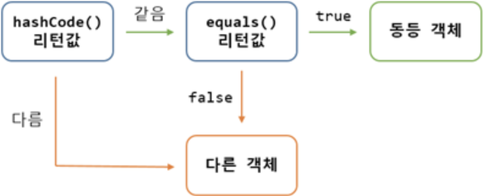

### Object 클래스에는 어떤 메소드가 있는가?

- equals(), hashCode(), toString(), clone() 등이 있음

- equals는 기본적으로 "==" 연산과 동일한 결과가 리턴된다. _(주소 값 비교)_
- 실질적으로는 하위 클래스에서 equaals()가 재정의되어서 메모리 주소 비교가 아닌 논리적으로 동등한 지를 판단하는 것으로 사용

- hashCode()는 객체의 메모리 주소를 이용해서 해시 코드를 만들어서 리턴함
- HashTable, HashMap, HashSet 내부에서 hashCode()를 사용하기 때문에 논리적 동등 비교 시 hashCode()를 오버라이딩 할 필요가 있음.
- 만약 hashCode()연산에서 동일하다고 판단되면 equals() 메소드로 재검사. 이 과정에서도 동일하다고 판단되면 실제로 동등 객체로 판단, 아니라면 다른 객체로 판단함.
- Android의 ListAdapter의 DiffUtill에서도 이와 같은 방식으로 검사.



- Integer나 Long의 경우는 그 값 그대로를 HashCode로 사용
- String의 경우 초기값을 17로 하고 각 문자열을 아스키코드나 UTF로 인코딩한 값을 이용해서 구함

```
예를 들어, "abc"의 경우:

'a'의 ASCII 값은 97, 'b'는 98, 'c'는 99입니다.

계산: (97 * 31^2) + (98 * 31) + 99
→ 97 * 961 = 93217, 98 * 31 = 3038, 93217 + 3038 + 99 = 96354
그리고 "123"의 경우:

'1' = 49, '2' = 50, '3' = 51

계산: (49 * 31^2) + (50 * 31) + 51
→ 49 * 961 = 47089, 50 * 31 = 1550, 47089 + 1550 + 51 = 48690

복합 객체 (예: name: "abc", age: "123")
위와 같은 방식으로 hashCode()를 구현한다면,

초기값은 17

첫 번째 필드: result = 31 * 17 + "abc".hashCode()
→ 31 * 17 = 527, 527 + 96354 = 96881

두 번째 필드: result = 31 * 96881 + "123".hashCode()
→ 31 * 96881 = 3003311, 3003311 + 48690 = 3052001
```