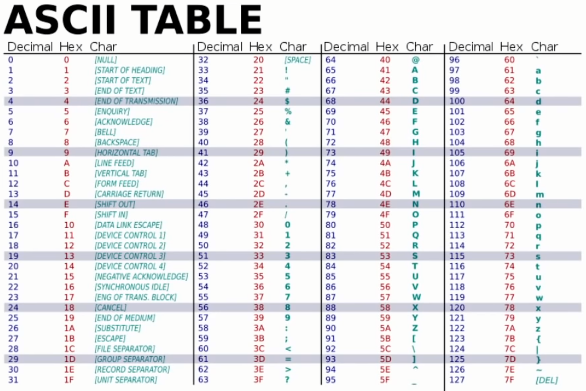
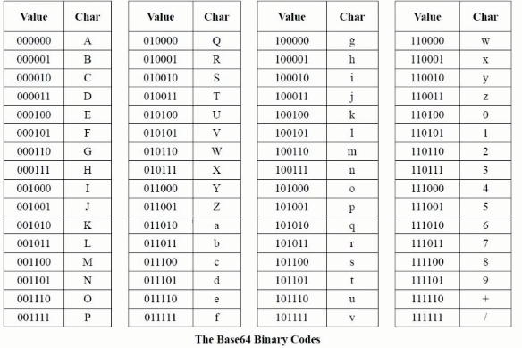

### ASCII 코드

- 일반적으로 데이터는 바이트 단위로 표현되는데, 8비트 중 7비트만 데이터 표현에 사용하고 1비트는 오류 검출 비트로 사용
- 매우 단순하여 어떤 시스템에도 적용이 가능함
- 2바이트 이상의 코드를 표현할 수 없음

   

### 확장 ASCII 코드

- 오류 검출로 사용하던 1비트를 데이터 표현으로 사용하며 128개의 데이터를 추가적으로 나타낼 수 있음
- 추가된 128개의 데이터는 국가와 기업마다 서로 다르게 정의하여 사용함

   

### 유니코드

- 모든 나라의 문자를 표현하기위해 하나의 문자 집합으로 나타낸 것
- 인코딩 방법으로 UTF-8, UTF-16, UTF-32 등이 있지만 주로 UTF-8이나 UTF-16을 사용함

#### UTF-8

- 하나의 문자를 1~4바이트 가변길이로 표현
- 1바이트 영역은 ASCII 코드와 호환되며 ASCII의 128개의 문자는 UTF-8과 동일하게 호환됨
- 중동과 유럽 지역의 언어는 2바이트로 표현, 한국을 포함한 아시아권은 3바이트 이상으로 표현됨
- 현재 인터넷에서 가장 많이 사용하는 인코딩 방법

#### UTF-16

- 고정 길이 2바이트 또는 4바이트의 가변길이로 표현
- 바이트 순서가 정해지지 않아 리틀/빅 엔디안 문제가 있어서 인터넷에서 사용을 권장하지 않음
- Windows 운영체제의 기본 인코딩 방식이지만 점점 UTF-8로 대체되고 있다고 함.
- 한글, 일본어, 중국어와 같이 UTF-8에서 3바이트 이상으로 사용되는 문자들은 UTF-16을 사용함으로써 더 유리할 수도 있다.

#### UTF-32

- 고정 길이 4바이트로 표현
- 모든 문자를 같은 크기로 저장하므로 인덱싱이 빠름
- 하지만 메모리 사용량이 많아서 비효율적이라 거의 사용되지 않음

   

### base64

- 이미지나 실행파일, ZIP파일과 같은 이진 데이터들을 아스키코드로 전송할 시 8비트 중 오류 검출로 사용하는 1비트의 용도가 나라, 기관마다 다달라서 생기는 문제를 해결하기 위해 등장
- 네트워크, 이메일 등 일부 시스템은 "순수 텍스트(ASCII)만 허용"하기 때문에, 바이너리 데이터를 안전하게 전송하기 위해 사용됨.
- base64로 인코딩할 경우 아스키 코드에 비해서 33%의 용량을 더 차지하지만, 안전하게 데이터를 보낼 수 있게됨.
- 인코딩 하는 방법은 아스키 코드로 먼저 인코딩 한 다음, 6bit씩 끊어서 base64 인코딩으로 변경함.
- 만약 6비트씩 끊어지지 않을경우 패딩 비트 0을 추가하고 마지막에 패딩이 추가되었다는 뜻에 =를 추가함.

