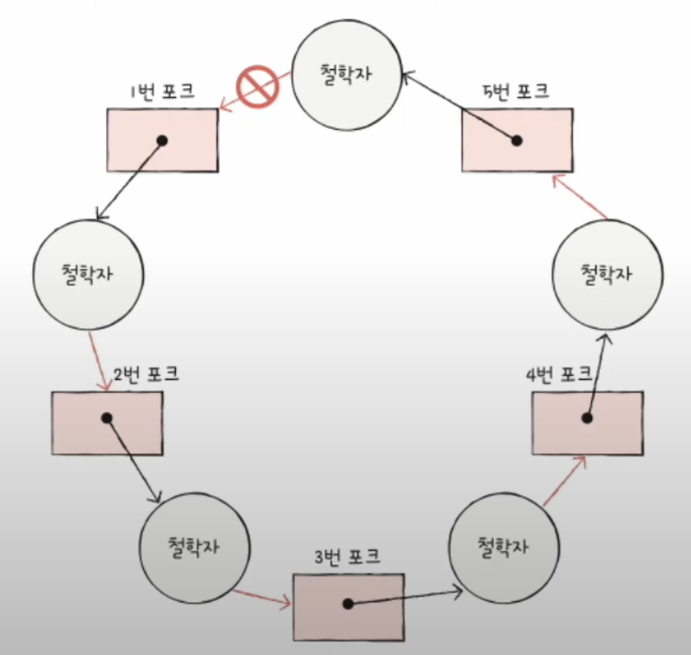

### 동기화란 ?

- 실행 순서 제어를 위한 동기화
- 상호 배제를 위한 동기화

### 비동기란 ?

- 실행 순서가 보장되지 않는 실행 방식
- 요청한 작업에 대해 완료 여부를 따지지 않음

A, B, C 작업이 순차적으로 시작되었는데, 그 순서가 지켜진다면 동기이고 순서가 지켜지지 않는다면 비동기임.

### Blocking 이란 ?

- 현재 작업에서 다른 요청의 작업을 처리하기 위해 현재 실행하고 있던 작업을 막고 (대기시키고) 작업을 진행하는 방식
- 제어권을 A함수에서 B함수로 넘겨준다라는 말을 사용하기도 함 (여기서 말하는 제어권이란 함수의 코드나 프로세스 실행 순서를 제어하는 권리)

### Non-Blocking 이란 ?

- 현재 작업에서 다른 요청의 작업을 처리하더라도, 현재 작업을 막지 않고 다른 작업을 진행하는 방식
- 제어권을 그대로 A함수에서 갖고 B함수는 실행만 시켜놓음.


<br><br><br>

#### Reader Writer Problem

- Writer : Book.txt 파일에 값을 저장하는 프로세스
- Reader : Book.txt 파일에 저장된 값을 읽어들이는 프로세스
- Reader와 Writer 프로세스는 무작정 아무렇게나 실행되어선 안된다.
- Reader 프로세스는 Wirter 프로세스가 동작한 이유 실행되어야 함.
- 동시 다발적으로 실행되는 프로세스가 있을 때 실행 순서를 제어함으로써 해결

#### Bank account Problem

- 한 번에 하난의 프로세스만 접근해야 하는 자원에 동시 접근을 피하기 위한 동기화
- 은행 계좌에 동시에 쓰기 작업이 발생했을 경우 무시되는 경우가 생길 수 있음
- 프로세스 A는 현재 잔액에 2만원을 추가하는 프로세스
- 프로세스 B는 현재 잔액에 5만원을 추가하는 프로세스
- 프로세스 A와 프로세스 B가 동시에 실행되면 2만웜만 추가되거나 5만원만 추가되거나 될 수 있음

#### Producer & Consuemr Problem

- 동시에 접근해서는 안되는 자원에 동시에 접근해서 발생한 문제
- 물건을 계속해서 생산하는 생산자 (Producer)
- 물건을 계속하는 소비하는 소비자 (Consumer)
- "총합" 변수 공유

```
총합 = 10

생산자 () {
    버퍼에 데이터 삽입
    "총합" 변수 1 증가
}

소비자 () {
    버퍼에 데이터 빼내기
    "총합" 변수 1 감소
}
```

- 생산자를 10만번, 소비자를 10만번 실행하면 총합은? 10이 나올까?
- 실제로 코드를 동작하면 전혀 예상하지 못한 값이 나올 수 있음

#### 공유 자원과 임계 구역

- 공유 자원 : 여러 스레드 및 프로세스에서 공유하는 자원을 의미함 ex) 전역 변수, 파일, 입출력장치, 보조기억장치
- 임계 구역 : 동시에 실행하면 문제가 발생하는 자원에 접근하는 코드 영역 ex) 앞선 예시에서 "총합" 변수, "잔액" 변수 등등

아래와 같은 한 줄 짜리 코드도,

```
총합 ++;
```

Low Level 언어로 변환되면,

```
r1 = 총합;
r1 = r1 + 1;
총합 = r1;
```

와 같이 여러 줄의 명령으로 바뀔 수 있으므로 실행되는 도중에 Context Switching이 발생할 경우 RaceCondition 문제가 발생할 수 있음

#### 운영체제가 임계구역 문제를 해결하는 세 가지 원칙

- 상호 배제 : 한 프로세스가 임계 구역에 진입했다면 다른 프로세스는 들어올 수 없다
- 진행 : 임계 구역에 어떤 프로세스도 진입하지 않았다면 진입하고자 하는 프로세스는 들어갈 수 있어야 한다.
- 유한 대기 : 한 프로세스가 임계 구역에 들어가고자 한다면, 언젠가는 임계 구역에 들어갈 수 있어야 한다.

<br><br><br>

### 스레드 동기화 방법

#### 실행 순서의 동기화

- 스레드의 실행순서를 정하고 이 순서에 반드시 따르도록 하는 것

#### 메모리 접근에 대한 동기화

- 메모리 접근에 있어서 동시접근을 막는 것, 실행의 순서가 중요한 상황이 아니고, 한 순간에 하나의 스레드만 접근하면 되는 상황을 의미

<br><br><br>

### 동기화 기법의 종류

#### 유저 모드 동기화

- 동기화가 진행되는 과정에서 커널 코드가 실행되지 않는 동기화 기법
- 동기화를 위해서 커널 모드로의 전환이 불필요하므로 성능상의 이점이 있음
- 하지만, 그 만큼 기능성의 제한도 존재함
- JVM이나 .NET과 같은 어플리케이션 수준에서 사용하는 동기화 기법. ex) 크리티컬 섹션 기반의 동기화, 인터락 함수 기반의 동기화

#### 커널 모드 동기화

- 커널에서 제공하는 동기화 기능을 활용하는 방법
- 동기화에 관련된 함수가 호출될 때마다 커널 모드로의 전환이 필요하고, 이는 성능의 저하로 이루어짐
- 하지만 그 만큼 유저 모드에서 사용하지 못하는 기능들도 사용할 수 있음.
- 운영체제 수준에서 사용하는 동기화 기법 시스템 콜과 같은 것들에 사용됨. ex) 뮤텍스 기반의 동기화, 세마포어 기반의 동기화, 이름있는 뮤텍스 기반의 프로세스 동기화, 이벤트 기반의 동기화

<br><br><br>

### Race Condition

- 공유 자원에 여러 프로세스가 동시에 접근할 때, 결과값에 영향을 줄 수 있는 상태
- 여러 개의 프로세스가 동일한 메모리에 접근할 때 생김
- 커널 작업을 수행하는 도중 인터럽트가 발생하여 동일한 메모리를 건드림
- 커널 작업을 수행하는 도중 타임아웃으로 인해 다른 스레드에 작업 권한이 넘어감. 이 때 동일한 메모리를 건드림

<br><br><br>

### Thread-Safe란?

- 멀티 스레드 환경에서 여러 개의 스레드가 공유 자원에 접근할 때, 의도한 대로 동작하는 것을 "Thread-Safe하다" 라고 말한다.
- 이는 공유 자원에 접근하는 Critical Section(임계 영역)을 동기화 하는 기법으로 제어해야 한다.
- 동기화 기법으로는 Mutex나 Semaphore 등이 있다.

<br><br><br>

### Mutex Lock

- 임계 구역을 가진 스레드들의 실행시간이 서로 겹치지 않고 각각 단독으로 실행되게 하는 기술
- 동시에 공유 자원에 접근하는 것을 막기 위해 Critical Section 에 진입하는 프로세스는 Lock 을 획득하고 Critical Section 을 빠져나올 때, Lock 을 방출함으로써 동시에 접근이 되지 않도록 한다.
- 뮤텍스는 0,1로 이진 세마포어라고 부르기도 함
- Context Switching이 발생하기 때문에 임계 구역의 실행 시간보다 Context Switching 시간이 더 클 경우 성능상 불이익이 있음

<br><br><br>

### Semaphore

- 공유된 자원의 데이터를 여러 프로세스가 접근하는 것을 막는 것
- 가용한 개수를 가진 자원 에 대한 접근 제어용으로 사용되며, 세마포는 그 가용한 자원의 개수 로 초기화 된다. 자원을 사용하면 세마포가 감소, 방출하면 세마포가 증가 한다.
- 초기 버전에는 SpinLock 기법을 사용하여 Busy Waiting 문제가 발생하였음. 이후에는 임계 영역에 진입하다가 실패한 스레드의 경우 block을 시킨 뒤 임계 영역 작업이 끝났을 때 꺠우는 방식으로 해결할 수 있음.
- 세마포를 활용해서 실행 순서 동기화도 시켜줄 수 있음.

```
S = 0

p1() {
    임계 구역
    signal()   // S의 값을 올림
}

p2() {  
    wait()     // S가 1이 될 때 까지 대기
    임계 구역
}
```

<br><br><br>

### Monitor

- 매번 임계구역 앞뒤로 wait(), signal()을 호출해야 할까? 휴먼 에러가 일어나기 쉽지 않을까?
- 사용자가 다루기에 편한 동기화 도구
- 상호 배제를 위한 동기화 및 실행 순서 제어를 위한 동기화 모두 지원
- 상호 배제를 지원하기 위해서 공유 자원에 접근하고자 하는 프로세스를 큐에 삽입하고, 순서대로 동작하도록 제어
- 실행 순서 제어를 지원하기 위해서 조건 변수를 이용함.

<br><br><br>

### SpinLock

- 임계 영역을 가진 스레드들의 실행시간이 서로 겹치지 않고 각각 단독으로 실행되게 하는 기술
- 임계 영역에서 이미 실행중인 스레드가 있을 경우 해당 영역을 원하는 작업은 계속해서 임계 영역을 확인함 (Busy Waiting)
- 임계 영역 내부의 작업 시간이 ContextSwitching 시간 보다 길 경우 Busy Waiting으로 인해 버려지는 CPU 점유 시간이 더 크기 때문에 SpinLock은 적절하지 않음.
- 반면, 임계 영역 내부 작업 시간이 ContextSwitching 시간 보다 짧을 경우 불필요한 ContextSwitching이 발생하지 않으므로 오히려 성능상으로 더 좋을 수 있음.

<br><br><br>

### DeadLock

- 두 개 이상의 프로세스나 스레드가 서로의 자원을 얻지 못해서 다음 작업을 처리하지 못하고 무한히 기다리는 상태
- 한정된 자원을 여러 곳에서 사용하려고 할 때 생김

#### 발생하는 이유?

- 상호 배제 (한 번에 하나의 프로세스만 메모리에 접근할 수 있음)
- 점유 대기 (자원을 소지한 채로 기다림)
- 순환 대기 (순환 형태로 프로세스가 자원을 대기하고 있음)
- 비선점 (다른 프로세스가 자원을 선점하고 있을 경우 해당 자원을 빼앗을 수 없음)

### DeadLock을 해결하는 방법

#### 예방

- 위 4개 중 하나라도 이뤄지지 않으면 DeadLock은 이뤄지지 않음.

- 상호 배제 부정 : 여러 프로세스가 공유 자원을 사용 (현실적으로 불가능한 방법)
- 점유 대기 부정 : 프로세스 실행 전, 해당 프로세스에 필요한 모든 자원을 할당 (자원 활용률이 떨어질 수 있음)
- 점유 대기 부정 : 자원을 점유하고 있지 않을 때에만 다른 자원을 요청할 수 있도록 함 (기아 상태가 될 수 있음)
- 비선점 부정 : 자원 점유 중인 프로세스가 다른 자원을 요구할 때 만약 가질 수 없다면 가진 자원을 모두 반납하고, 새 자원과 이전 자원을 얻을 수 있을 떄 까지 대기
- 순환 대기 부정 : 자원에 고유 부여 후 순서대로 자원 요구 (모든 자원에 번호를 붙이는 것이 어려움. 어떤 자원에 어떤 번호를 붙이느냐에 따라 자원 활용률이 달라짐)



- 예방을 사용하면 교착 상태를 발생하지는 않을 수는 있으나, 부작용이 발생함

#### 회피

- 교착 상태를 무분별한 자원 할당으로 인해 발생했다고 간주
- 자원을 할당할 때 조심 조심 할당
- 배분할 수 있는 자원의 양을 고려하여 교착 상태가 발생하지 않을 만큼만 자원 배분

- 안전 순서열 : 교착 상태 없이 안전하게 프로세스들에게 자원을 할당할 수 있는 순서 ex) A, B, C 순서로 할당하니까 교착 상태가 발생하는데, B, C, A로 할당하니까 발생하지 않네? 이는 안전 순서열이겠구나.
- 안전 상태 : 교착 상태 없이 모든 프로세스가 자원을 할당받고 종료할 수 있는 상태. 안전 순서열이 있는 상태
- 불안전 상태 : 교착 상태가 발생할 수도 있는 상태. 안전 순서열이 없는 상태

- 즉, 안전 상태 -> 안전 상태로 움직이는 경우에만 자원을 할당하는 방식

https://www.youtube.com/watch?v=zQDNXklvdUw&list=PLVsNizTWUw7FCS83JhC1vflK8OcLRG0Hl&index=38

#### 탐지 및 회복

- 교착 상태의 발생을 인정하고 사후에 조치하는 방식
- 프로세스가 요구하면 일단 자원 할당, 교착 상태가 검출되면 회복
- 선점을 통한 회복 : 교착 상태가 해결될 때 까지 한 프로세스에 자원을 몰아주는 방식
- 프로세스 강제 종료를 통한 회복 등이 있음 (타조 알고리즘)

#### 식사하는 철학자

- 교착 상태를 나타내기 위해 다익스트라가 고안한 예시의 문제
- 둥근 원탁에 n명의 철학자가 있고, n개의 포크가 철학자들 사이사이에 있음.
- 철학자들은 먼저 왼쪽 포크를 든 다음 오른쪽 포크를 들고, 두 개의 포크가 모두 쥐어졌을 때 식사를 시작함.
- 식사를 마친 뒤 오른쪽 포크를 책상위에 두고 왼쪽 포크를 책상 위에 둠.
- 위와 같은 규칙이 있을 때, 모든 철학자가 동시에 식사를 하려고 하면 그 어떤 철학자도 식사를 하지 못함.
- 이에 대한 해결책은 한 명이라도 포크를 늦게 들면 한 사람이라도 식사를 시작할 수 있으므로 해결됨. (즉, 순환 대기를 부정하는 방법)

#### 뱅커 알고리즘

- 교창 상태를 회피하는 방법에서 소개된 것과 같이, 안전 상태에서 안전 상태로 이동할 수 있는 경우에만 자원을 할당하는 방식
