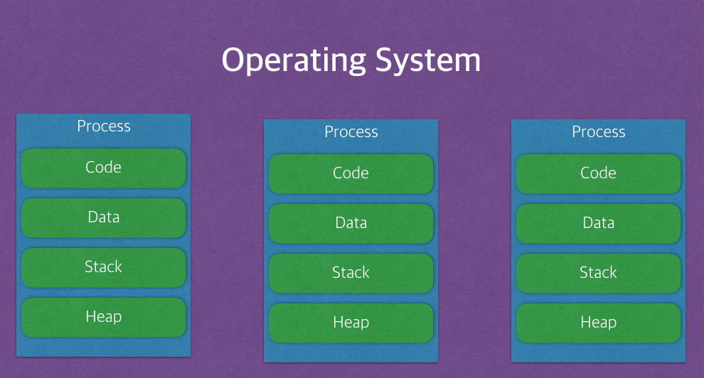

### 프로그램이란 ?

-> 어떤 작업을 위해 실행할 수 있는 파일

<br><br><br>

### 프로세스란 ?

-> 컴퓨터에서 실행되고 있는 프로그램
-> 메모리에 올라와 있는 프로그램의 인스턴스 (독립적인 개체, 두개 실행하면 두개 생김)
-> 운영체제로부터 시스템 자원을 할당받는 작업의 단위
-> 실행된 프로그램을 의미
-> 할당받는 시스템 자원 (CPU, 운영에 필요한 주소 공간, 메모리 영역)

<br><br><br>

### 프로세스의 메모리 영역

--> 프로세스는 각각 독립적인 (코드, 데이터, 힙, 스택) 영역을 갖게된다.

----> 코드 : 코드 자체를 구성하는 메모리 영역 (프로그램 명령, 진짜 코드 그 자체임)
----> 힙 : 동적 할당 시 사용 (new(), malloc() 등)
----> 스택 : 지역 변수, 매개 변수, 리턴 값 (전역 변수랑 정적 변수 빼고, 임시 메모리 영역)
----> 데이터 : 전역 변수, 정적 변수, 배열 등
------> 초기화된 데이터는 Data 영역에 저장
------> 초기화되지 않은 데이터는 BSS 영역에 저장 (여기서 말하는 BSS 영역이란, Block Started by Symbol의 약자로 초기화되지 않은 전역 변수나 정적 변수가 저장되는 메모리 영역임)

<br><br><br>

### BSS 영역?

전역 변수와 정적 변수의 초기화 여부: 전역 변수나 정적 변수는 선언 시 초기값을 명시하지 않으면 기본적으로 초기화되지 않은 것으로 간주되어 BSS 영역에 배치된다.

```c
int globalVar;        // 초기값이 명시되지 않으므로 BSS 영역에 위치, 실행 시 0으로 초기화됨
static int staticVar; // 함수 내 또는 파일 범위에서 선언된 정적 변수도 초기값 미지정 시 BSS 영역에 위치
```

반면,

```c
int globalVar = 10;        // 명시적 초기화로 data 영역에 위치
static int staticVar = 20; // 명시적 초기화로 data 영역에 위치
```

이렇게 초기화 값을 지정하면, 그 값이 실행 파일에 저장되고 data 영역에 배치된다.

왜 구분하는가?
--> 초기화되지 않은 변수들은 실행 파일에 초기값을 저장하지 않아도 되므로 실행 파일의 크기를 줄이고, 메모리 할당을 보다 효율적으로 관리할 수 있기 때문.

<br><br><br>


--> 프로세스는 기본적으로 최소 1개의 스레드 영역을 가지고 있음.
--> 각 프로세스는 별도의 주소 공간에서 실행되며, 한 프로세스는 다른 프로세스의 변수나 자료구조에 접근할 수 없음.
--> 한 프로세스가 다른 프로세스의 자원에 접근하려면 IPC(inter-process-communication)을 사용해야 함

<br><br><br>

### 스레드란 ?

--> 프로세스 내에서 실행되는 여러 흐름의 단위
--> 프로세스의 특정한 수행 경로
--> 프로세스가 할당받은 자원을 이용하는 실행의 단위



--> 프로세스에서 할당받은 자원 중에 스택과 레지스터를 빼고 다른 영역은 공유.

#### 스택을 따로 할당하는 이유 ?

스택은 함수 호출 시 전달되는 인자, 되돌아갈 주소값 및 함수 내에서 선언하는 변수 등을 저장하기 위해 사용되는 메모리 공간이므로 스택 메모리 공간이 독립적이라는 것은 독립적인 함수 호출이 가능하다는 것.
이는 독립적인 실행 흐름이 추가되는 것이다. 따라서 스레드의 정의에 따라 독립적인 실행 흐름을 추가하기 위한 최소 조건으로 독립된 스택을 할당한다.
즉, 독립적인 실행 흐름이 추가되는 것

#### 레지스터를 따로 할당하는 이유 ?

PC 레지스터는 다음번에 실행될 명령어를 기억하는 레지스터이다. 스레드가 스위칭 되더라도 PC 레지스터를 남겨둠으로써 어디까지 명령어를 실행했는 지를 기억하고,
해당 레지스터를 기점으로 다시 작업을 재개시키므로 각 스레드를 독립적으로 홛동시키기 위해서 필요하다.

<br><br><br>

즉, 프로세스는 자신만의 고유한 독립적인 자원을 OS로부터 할당받지만, 스레드는 별도로 자원을 할당받지 않고 동일한 프로세스 내에서 레지스터와 스택을 제외하고 공유 자원을 사용함. 

<br><br><br>

### 멀티 프로세스란 ?

--> 하나의 작업을 수행하기 위해 여러 개의 프로세스를 만들어 자원을 할당받고 작업하는 방식.
--> 프로세스는 각각 독립적인 메모리 영역을 가지기 때문에, 다른 프로세스가 서로의 메모리 자원을 침범하지 못함.

#### 장점
- 각 메모리가 OS의 관리에 의해 다뤄지므로 메모리를 안정적으로 사용할 수 있음
- 하나의 프로세스가 죽어도 다른 프로세스에서는 안전하게 동작 가능

#### 단점
- Context Switching 비용이 큼
- 케시 무효화가 발생함
- 높은 메모리 사용량
- 프로세스간 통신을 위해 IPC를 사용해야 함.

<br><br><br>

### 멀티 스레드란 ?

--> 하나의 프로세스 내에서 여러 개의 독립된 실행 흐름(스레드)을 생성하여 동시에 작업을 수행하는 방식

#### 장점
- 멀티 프로세스에 비해서 Context Switching 비용이 적음
- 공유된 자원을 사용하므로 성능상으로도 더 우수함
- 멀티 프로세스 방식은 프로세스 간 통신을 IPC로 하는 데에 반해, 멀티 스레드 방식은 공유 메모리를 이용해서 하므로 훨씬 가벼움

#### 단점
- 하나의 스레드에서 공유 자원을 훼손시키면 그 자원을 사용하는 이외의 스레드들도 모두 고장나버림.
- 공유된 자원을 동기화하지 않으면 Race Condition, Deadlock과 같은 문제가 생길 수 있음.

<br><br><br>

### Thread-Safe란?

--> 멀티 스레드 환경에서 여러 개의 스레드가 공유 자원에 접근할 때, 의도한 대로 동작하는 것을 "Thread-Safe하다" 라고 말한다.
--> 이는 공유 자원에 접근하는 Critical Section(임계 영역)을 동기화 하는 기법으로 제어해야 한다.
--> 동기화 기법으로는 Mutex나 Semaphore, SpinLock 등이 있다.