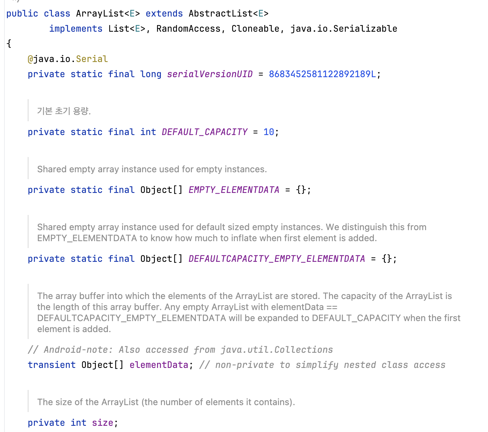
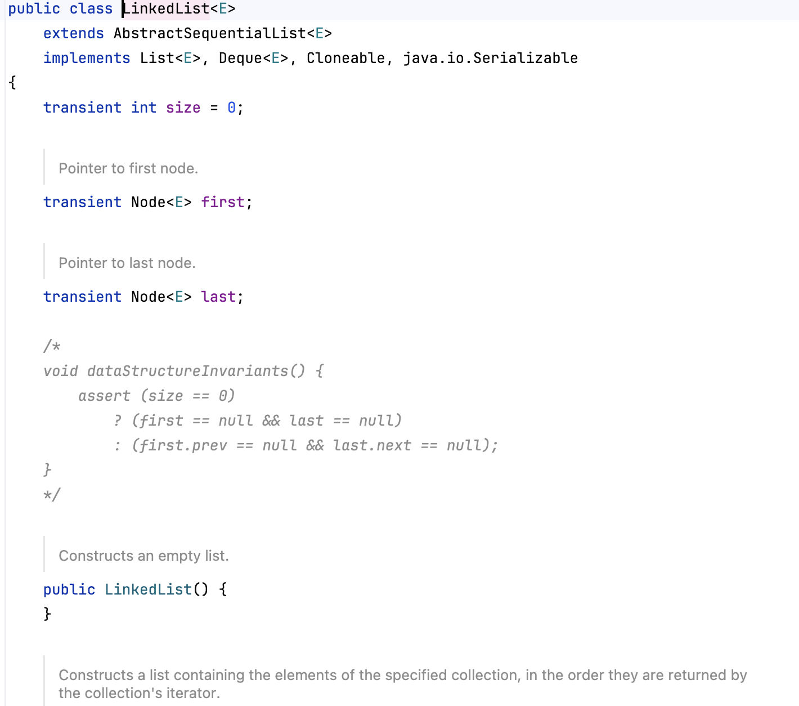

### List

- 값들을 저장하는 추상 자료형
- 중복을 허용
- 순서가 있음
- Set이나 Map을 사용하는 것이 적절한 상황이 아니라면, 일반적으로 List 사용

   

### ArrayList

- 배열을 사용해서 List를 구현
- 마지막 인덱스가 아닌, 중간이나 처음 인덱스에 데이터를 삽입, 삭제하려고 할 경우 데이터의 Shift가 필요하므로, 중간에 삽입, 삭제하는 작업이 많은 상황에서는 불리
- 반면, 연속된 주소로 구성되어 있으므로 특정 인덱스에 조회는 O(1)로 가능하기 떄문에 삽입,삭제보다 조회가 많은 상황에서 유리
- 특정 값이 있는 지 없는 지 판단할 때에는 해당 값이 나올 떄 까지 0번 인덱스부터 마지막 인덱스 까지 탐색해야 함. O(N)
- 내부적으로 배열로 구현되어 있기 때문에, 배열이 가득 찰 경우 자바는 기본 크기가 10, 가득 찰 때마다 1.5배의 크기로 확장해서 데이터를 옮김.

  

- [배열 확장 레퍼런스](https://chunsubyeong.tistory.com/82)

   

### LinkedList

- 노드를 이용해서 값을 표현, 이를 연결 시키는 형태로 구현
- 처음 값을 나타내는 Head와 마지막임을 나타내는 Tail이 존재
- 메모리에 연속된 위치로 저장되는 것이 아니라, 각 포인터를 통해서 다음 노드를 연결하기 때문에 따로따로 저장됨. 그렇기 떄문에 인덱스로 조회하는 로직에서는 Head에서 부터 순차적으로 접근해야 하기 때문에 반드시 O(N)의 시간 복잡도를 가짐
- 반면, 데이터를 중간 인덱스에 삽입하거나 삭제할 때 이전 Node와 다음 Node의 Prev와 next 포인터만 바꿔주면 되므로 인덱스를 통해 조회하는 것 보다 중간에 삽입, 삭제이 많은 상황에서 유리 (단, 삭제, 추가하려는 인덱스 까지는 Head에서부터 탐색해야 함)
- 만약 Tail이 없었다면, 값을 삽입하는 과정에서 반드시 Head로 부터 마지막 까지 탐색해야 하기 때문에 Tail 포인터를 둠으로써 시간 비용을 최적화 함.
- 특정 값이 있는 지 없는 지 판단할 때에는 해당 값이 나올 떄 까지 0번 인덱스부터 마지막 인덱스 까지 탐색해야 함. O(N)

  

   

### ArrayList vs LinkedList

| 항목               | **ArrayList**                        | **LinkedList**                       |
| ---------------- | ------------------------------------ | ------------------------------------ |
| **구현 방식**        | 배열(`Array`) 기반                       | 노드(Node) 기반                          |
| **데이터 접근 시간**    | 인덱스 접근 O(1), 연속된 메모리 배치              | 인덱스 접근 O(N), Head부터 순차 탐색            |
| **삽입 / 삭제 시간**   | 끝에 추가 O(1), 중간 삽입/삭제 시 데이터 이동 → O(N) | 탐색 시간 O(N) + 삽입/삭제 자체는 포인터 변경으로 O(1) |
| **리스트 크기 확장**    | 배열이 꽉 차면 새 배열 생성 후 복사 (1.5배 확장)      | 포인터만 연결하므로 확장 시 추가 비용 거의 없음          |
| **검색 성능**        | 최악의 경우 O(N)                          | 최악의 경우 O(N)                          |
| **CPU Cache 효율** | 메모리 상 인접 → 캐시 히트율 높음                 | 비연속적 포인터 구조 → 캐시 미스 빈번               |

 

아직까지 개발하면서 LinkedList가 더 적절한 사례를 만나보지 못해서 아쉬움.
삽입, 삭제 이후 데이터 shift가 없다는 점에서 중간 삽입, 삭제가 더 빠르다곤 하더라도, 해당 인덱스로 접근해야 하는 면에서 LinkedList가 과연 더 좋은 것인가에 대한 의문이 있긴 함.
남은 것은 배열 확장에 드는 리소스 vs CPU Cache에서의 이점인데 드라마틱한 차이가 있을 것 같지 않아서 대부분은 ArrayList를 사용한다고 함.
