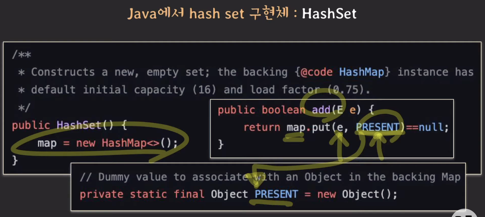

### Map

- Key - Value 쌍을 저장하는 자료구조
- 같은 Key를 가지는 Pair는 최대 한개만 존재 가능
- Dictionary, Associative Array 라고 부르기도 함

   

### Hash Table

- 배열과 해쉬 함수를 사용하여 Map을 구현한 자료구조
- 일반적으로 상수시간으로 접근하기 때문에 빠름
- 해쉬란, 임의의 크기를 가지는 타입의 데이터를 고정된 크기를 가지는 타입의 데이터로 변환하는 함수
- Hash Table에서는 임의의 데이터를 임의의 정수로 바꿔서 인덱스로 사용함.

   

### 해쉬 충돌 해결 방법

#### Seperate Chaining

- 배열 테이블에서 인덱스에 바로 값을 넣는 것이 아니라, 주소를 넣어서 LinkedList로 이용
- 똑같은 해쉬 값의 값이 들어올 때 _(해쉬 충돌이 일어났을 때)_ 해당 인덱스의 Head _(맨 앞에)_ 새로운 항을 삽입
- 이 때 값을 저장할 때에는 똑같은 해쉬 값을 가지므로 각 원소를 구분하기 위해 Key-Value도 함께 저장
- 자바에서는 항이 8개가 이상이 되면 레드 블랙 트리 _(균형 이진 트리)_ 로 바뀌고, 6개이하가 되면 다시 LinkedList 형태로 바뀜

#### Open Addressing

- Linear Probing : 해쉬 충돌이 일어난 인덱스에서 충돌이 일어난 횟수 만큼 i를 추가한 인덱스에 값을 삽입
- Quadratic Probing : 해쉬 충돌이 일어난 인덱스에서 충돌이 일어날 횟수 i의 지수승 만큼 추가한 인덱스에 값을 삽입
- Double Hashing : 충돌이 발생했을 때 전혀 다른 해쉬 함수를 추가적으로 활용해서 인덱스로 사용. 
- 이 때, 두 번째 해쉬 함수의 값이 map 사이즈와 서로소여야지만 모든 인덱스를 탐색할 수 있음.

#### Open Addressing 주의할 점

- 해쉬 충돌이 일어났을 때 그 다음 인덱스에 삽입을 하는 이 원리에서, 중간 징검다리를 해주던 값이 사라지면 값이 있어도 없다고 판별할 수도 있음
- 값이 삭제되었을 때 실제로 값이 삭제되는 Hard Delete가 아닌 Soft Delete 문제 해결할 수 있음. 단점으로는 soft delete된 값을 만나면 무조건 다음 위치를 확인해야 함
- 값이 삭제되었을 때 그 다음 항의 값을 해당 인덱스로 끌고옴. 삭제가 일어날 때 마다 추가 연산이 발생

   

### Load Factor

- Load Factor (부하율) = 현재 저장된 요소 / 해쉬 테이블 크기
- 해쉬 테이블이 너무 가득 차면 충돌이 증가하고 성능이 저하됨
- 자바에서는 기본적으로 부하율이 0.75를 넘으면 Hash Table의 크기를 2배로 증가시킴
- HashTable의 경우 기본 크기가 11이며, Load Factor가 0.75를 넘어갈 때마다 *2 +1을 수행함
`11 -> 23 -> 47 -> 95...`
- HashMap의 경우 기본 크기가 16이며, Load Factor가 0.75를 넘어갈 때마다 *2를 수행함
`16 -> 32 -> 64 -> 128...`

   

### Set

- 데이터를 저장하는 추상 자료형
- 데이터의 순서를 보장하지 않음
- 데이터의 중복을 허용하지 않음
- 데이터의 조회 속도가 O(1)임
- 중복된 데이터를 제거할 때 좋음
- 특정 값이 있는 지 판단할 때 좋음 _(Map의 경우 Key는 O(1)로 조회 가능하지만, Value는 모두 탐색해야 함. Set은 Value를 O(1)로 조회)_

   

### Hash Set

- 해쉬 테이블을 이용해서 Set을 구현
- 자바에서는 HashMap으로 구현, Value 자리에 Null을 대입
- 확인할 때에는 해당 Key 값이 있는 지 없는 지만 체크

